# Build-OpenWrt.yml 编译流程详解

> 对应文件：`.github/workflows/Build-OpenWrt.yml`
>
> 这是一个**可复用工作流**（`on: workflow_call`），本身不直接触发，由 5 个机型 Workflow 通过 `uses: ./.github/workflows/Build-OpenWrt.yml` 调用，用 `with:` 传入编译参数。所有机型共享同一条流水线。

---

## 1. 整体流程图（Mermaid）

```mermaid
flowchart TB
    subgraph Callers["调用方（5 个机型 Workflow）"]
        C1["IPQ60XX-LibWrt.yml"]
        C2["IPQ807X-LibWrt.yml"]
        C3["JDCloud-ImmortalWrt.yml"]
        C4["JDCloud-NoWiFi-ImmortalWrt.yml"]
        C5["x86-64-ImmortalWrt.yml"]
    end

    Callers -->|"workflow_call + with 传参<br/>repo_url / repo_branch / config_file / firmware_tag<br/>kernel_file / artifact_prefix / manifest_file<br/>release_summary + 4 个开关"| S1

    subgraph Pipe["Build-OpenWrt.yml · Job: Build（ubuntu-24.04 · timeout 360min · concurrency 按机型排队）"]
        direction TB
        S1["① Check Server Performance<br/>打印 CPU / 内存 / 磁盘（纯提示）"]
        S2["② Initialization Environment<br/>apt-get 安装全套 OpenWrt 编译依赖 + 设时区"]
        S3["③ Checkout<br/>actions/checkout@v4 · persist-credentials: false"]
        S4["④ Clone Source Code<br/>git clone --depth 1 --single-branch → /mnt/openwrt<br/>记录 VERSION_INFO、提取内核版本"]
        S5["⑤ Generate Variables<br/>make defconfig 提取机型 → 拼装缓存 key"]
        S6["⑥ Cache Toolchain<br/>actions/cache 恢复 .ccache + staging_dir"]
        S7["⑦ Refresh The Cache<br/>touch 所有 stamp 文件防过期"]
        S8["⑧ Install Feeds<br/>feeds update -a / feeds install -a"]
        S9["⑨ Load Custom Configuration<br/>执行 scripts/Roc-script.sh 深度定制"]
        S10["⑩ Download DL Package<br/>cat 机型配置 + General.config → defconfig → make download"]
        S11["⑪ Compile Firmware<br/>make -j$(nproc) 或 make -j1 或 make -j1 V=s"]
        S12["⑫ Check Space Usage（纯提示）"]
        S13["⑬ Organize Files<br/>整理 .config / .manifest / Packages.tar.gz"]
        S14["⑭ Upload Firmware To Release<br/>ncipollo/release-action · tag = firmware_tag"]
        S15["⑮ Delete Old Cache<br/>仅保留当前 CACHE_KEY"]
        S16["⑯ Delete Old Workflows<br/>删除 2 天前已结束的运行"]
    end

    S1 --> S2 --> S3 --> S4
    S4 -->|"env: OPENWRT_PATH / VERSION_INFO / VERSION_KERNEL"| S5
    S5 -->|"env: SOURCE_REPO / DEVICE_TARGET / DEVICE_SUBTARGET / HASH / CACHE_PREFIX / CACHE_KEY"| S6
    S6 --> S7 --> S8 --> S9 --> S10 --> S11
    S11 -->|"成功：env DATE / FILE_DATE"| S12
    S12 --> S13
    S13 -->|"env: FIRMWARE_PATH · 仅编译成功"| S14
    S14 -->|"仅编译成功"| S15
    S15 -->|"仅 delete_old_workflows = true"| S16
    S11 -.->|"编译失败：跳过 ⑬~⑯"| E["Job 结束（失败）"]
```

---

## 2. GITHUB_ENV 变量传递关系

| 写入步骤 | 变量 | 消费方 |
| --- | --- | --- |
| ④ Clone Source Code | `OPENWRT_PATH`（源码绝对路径） | ⑤ ⑥ ⑧ ⑨ ⑩ ⑪ ⑬ |
| ④ Clone Source Code | `VERSION_INFO`（作者/时间/commit/hash） | ⑭ Release 说明 |
| ④ Clone Source Code | `VERSION_KERNEL`（自动提取的内核版本） | ⑭ Release 说明 |
| ⑤ Generate Variables | `SOURCE_REPO` / `DEVICE_TARGET` / `DEVICE_SUBTARGET` | 缓存 key 与诊断 |
| ⑤ Generate Variables | `HASH`（源码 commit） | ⑥ 缓存 key 精确命中 |
| ⑤ Generate Variables | `CACHE_PREFIX` / `CACHE_KEY` | ⑥ ⑦ ⑮ |
| ⑪ Compile Firmware | `DATE` / `FILE_DATE` | ⑭ 发布时间信息 |
| ⑬ Organize Files | `FIRMWARE_PATH`（产物目录） | ⑭ 上传附件 |

> 传递机制：`echo "KEY=VALUE" >> "$GITHUB_ENV"`（多行值用 `KEY<<EOF ... EOF`），后续步骤通过 `${{ env.KEY }}` / `$KEY` 读取。步骤间独立输出用 `$GITHUB_OUTPUT`（本工作流仅 ⑪ 的 `status=success` 作为后续步骤的开关）。

---

## 3. 16 步骤速查表

| # | 步骤 | 关键操作 | 产物 / 输出 | 执行条件 |
| --- | --- | --- | --- | --- |
| ① | Check Server Performance | 打印 CPU 型号/核心数、内存、磁盘并警告性能 | 无 | 总是 |
| ② | Initialization Environment | `apt-get` 安装约 60 个编译依赖，`timedatectl` 设 `Asia/Shanghai` | 编译环境 | 总是 |
| ③ | Checkout | 检出本仓库（configs/、scripts/），不保留 git 凭据 | 仓库文件 | 总是 |
| ④ | Clone Source Code | 浅克隆源码到 `/mnt/openwrt`，记录版本信息、提取内核版本 | `OPENWRT_PATH`、`VERSION_INFO`、`VERSION_KERNEL` | 总是 |
| ⑤ | Generate Variables | 复制机型 config → `defconfig` → 提取 board/subtarget/hash | `SOURCE_REPO`、`DEVICE_TARGET`、`DEVICE_SUBTARGET`、`HASH`、`CACHE_PREFIX`、`CACHE_KEY` | 总是 |
| ⑥ | Cache Toolchain | `actions/cache` 恢复 `.ccache` + `staging_dir`（key 精确到 hash，前缀回退） | 缓存命中 → 大幅缩短编译 | 总是 |
| ⑦ | Refresh The Cache | `touch` 全部 `stamp` 文件 | 防止缓存过期、避免误重编 | 总是 |
| ⑧ | Install Feeds | `feeds update -a` + `feeds install -a` | 原版 feeds | 总是 |
| ⑨ | Load Custom Configuration | 执行 `scripts/Roc-script.sh`（改默认 IP、解锁 1.5GHz、稀疏克隆替换包、注入 uci-defaults 等） | 深度定制后的源码树 | 总是 |
| ⑩ | Download DL Package | `cat 机型配置 + General.config` → `defconfig` → `make download`；`remove_sqm_scripts_nss` 时删对应项 | 最终 `.config`、`dl/` 源码包 | 总是 |
| ⑪ | Compile Firmware | `make -j$(nproc)` → 失败降级 `make -j1` → 再失败 `make -j1 V=s` | 固件镜像；成功时 `DATE`、`FILE_DATE`、`status=success` | 总是 |
| ⑫ | Check Space Usage | `df -hT` 打印磁盘 | 无 | `!cancelled()` |
| ⑬ | Organize Files | 复制 `.config`、重命名 `.config.buildinfo` / `.manifest`、收集全部 `.apk/.ipk` 打成 `Packages.tar.gz`、按需 `rename_qualcommax_to_nowifi` | `FIRMWARE_PATH` 下成套产物 | ⑪ 成功 |
| ⑭ | Upload Firmware To Release | `ncipollo/release-action`，`tag = firmware_tag`，`allowUpdates` 增量上传，body 模板组装 | Release 附件 | ⑪ 成功 |
| ⑮ | Delete Old Cache | `gh cache list/delete`，只保留当前 `CACHE_KEY` | 释放缓存配额 | ⑪ 成功 |
| ⑯ | Delete Old Workflows | `gh run list/delete`，删除 2 天前已结束的运行 | Actions 列表清爽 | `delete_old_workflows = true` |

---

## 4. 关键设计点

1. **缓存 key 精确到 commit hash**：`<仓库>-<分支>-<board>-<subtarget>-<hash>`，源码一变缓存即失效；`restore-keys` 前缀回退到最近旧缓存，实现"接近增量"编译。
2. **两次 defconfig**：⑤ 仅为提取机型变量（会覆盖 .config，但 ⑩ 会重新 `cat` 覆盖回来，无副作用）；⑩ 才是最终配置的生成点。
3. **三级降级编译**：全核并行 → 单线程兜底 → 单线程 + `V=s` 详细日志，应对并行编译的内存不足/竞态问题。
4. **产物成套发布**：固件 + `.config` + `.config.buildinfo` + `.manifest` + `Packages.tar.gz` 一次发布到同一 Tag，`allowUpdates` 支持定时重建增量更新。
5. **自动清理**：只保留本次缓存、按需清理 2 天前的运行记录，避免 GitHub 配额与列表被历史版本占满。
6. **安全细节**：`persist-credentials: false` 防止第三方克隆泄漏令牌；发布使用 `github.token` 与 git 凭据解耦。

---

## 5. 失败路径

- ⑪ 编译失败：⑫ 仍执行（`!cancelled()`），⑬~⑮ 全部跳过（`if: compile success`），不发布任何产物，Job 标记失败。
- ⑬ `package_extension` 非 `apk/ipk` 或找不到任何软件包文件：直接 `exit 1` 报错终止。
- ⑭ 上传失败：Job 失败，但已生成的产物仍在 runner 上（可通过 Artifacts 兜底排查）。
- 缓存未命中（首次运行或源码变更）：按完整编译执行，耗时最长（约 1–2 小时）。
